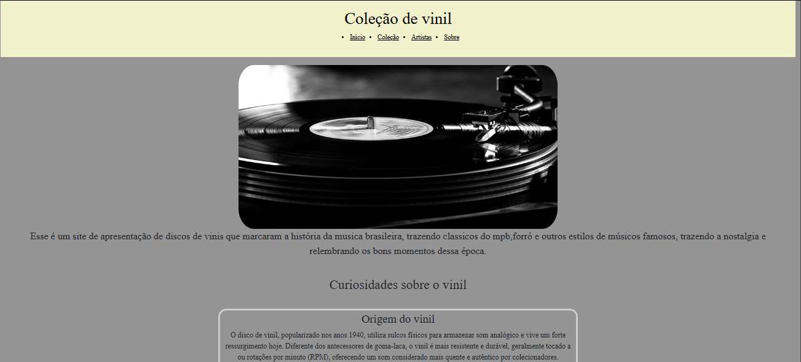
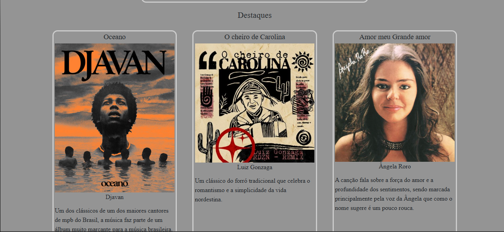
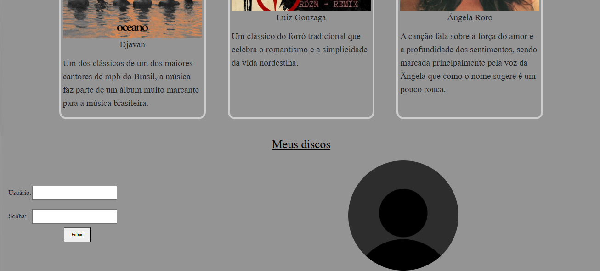
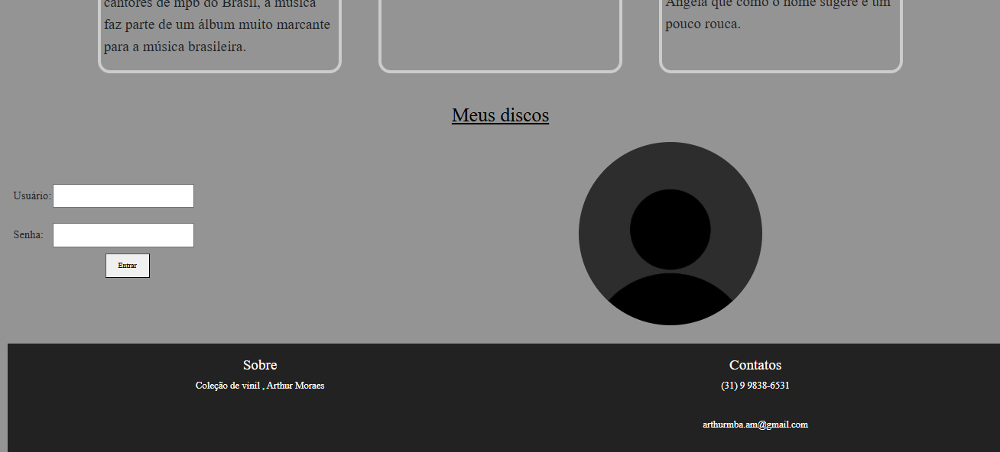
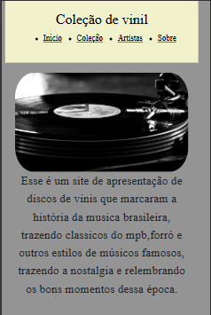
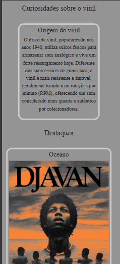
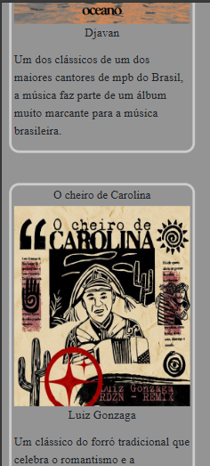
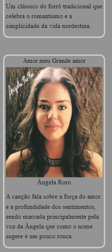
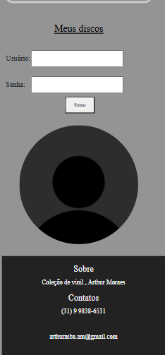

# Trabalho Prático - Semana 6

Nessa atividade, como sempre, vamos evoluir o que foi feito na semana anterior. Fique atento para fazer o projeto da semana anterior e dar sequência nessa jornada.

No trabalho dessa semana vamos alterar o projeto para que a responsividade da home-page seja feita, agora, com o framework Bootstrap.

**IMPORTANTE 1:** Você deve alterar apenas os arquivos **`README.md`**, **`index.html`** e **`styles.css`**, podendo incluir outros arquivos como imagens na pasta **`images`**, caso necessário. Deixe todos os demais arquivos e pastas desse repositório inalterados. **PRESTE MUITA ATENÇÃO NISSO.**

## Informações Gerais

- Nome:Arthur Moraes Braga Araujo
- Matricula:1025300
- Proposta de projeto escolhida: Proposta 4- Coleções e itens
- Breve descrição sobre seu projeto: Um site para facilitar a pesquisa de discos de vinis que se tornou uma raridade nos dias de hoje e que algumas pessoas possuem o interesse por sua raridade e exclusividade, o site é um meio para facilitar que usuários que desejam comprar ou procurar lojas que vendem os discos encontrem o que desejam.

## Print da versão responsiva com Bootstrap [DESKTOP]

## Print da versão responsiva com Bootstrap [MOBILE] (*)

(*) Utilize as ferramentas do desenvolvedor do seu navegador para colocar no modo reponsivo, escolha um celular qualquer e recarregue a página antes de tirar o print. 